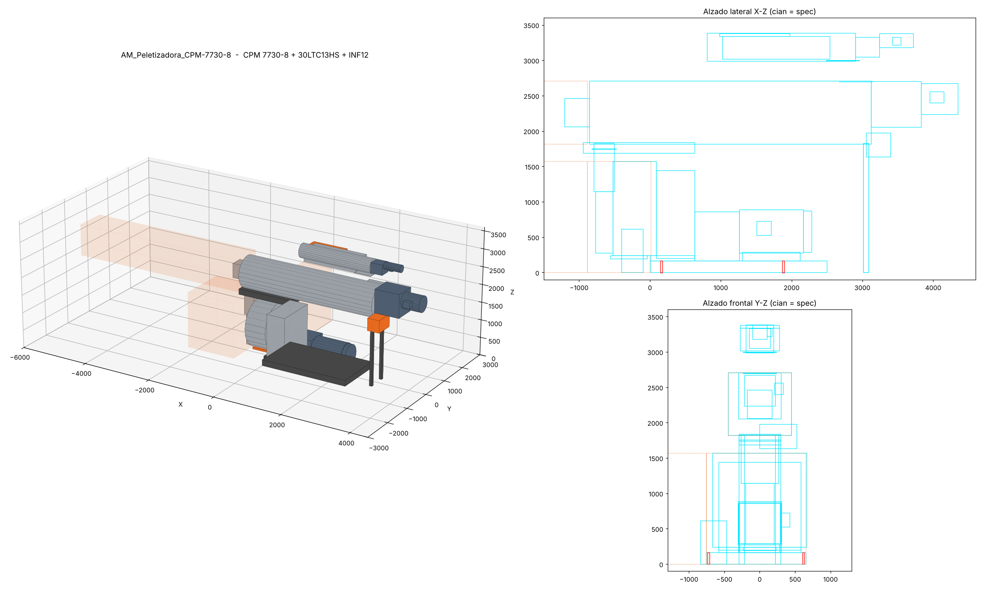

# PEL-01 · Peletizadora CPM 7730-8 + acondicionador 30LTC13HS + alimentador INF12

**Familia:** `AM_Peletizadora_CPM-7730-8.rfa` · tipo `CPM 7730-8 + 30LTC13HS + INF12` · categoría Equipos mecánicos
**Fuente:** CPM *General Dimension Drawing* 2022.12.09 (`PELLET_MAGDALENA.dxf`, 1:1 mm, proyección en 3er ángulo)
**Spec:** `dynamo/specs/spec_PEL01_CPM7730.py` · **LOD 350** · AM_Confianza_Dimensional = *Media* (fuente CAD)

## Origen y ejes de la familia

| | |
|---|---|
| Origen | borde frontal de la base del molino (lado puerta) × eje longitudinal de la máquina × piso (NPT) |
| +X | a lo largo del acondicionador, de la puerta hacia los motores |
| +Y | lado izquierdo de la vista frontal del CAD (lado del sistema de lubricación) |
| CAD → familia | lateral: `X = x − 17592.2`, `Z = y − 274.4` · frontal: `Y = 14337.3 − x` |

Envolvente: X −1207 … 4350.6 (**5558**), Y −652 … 758 (**1410**), Z 0 … 3378.2 (**3378**). Las tres cotas coinciden con el plano.

## Piezas (LOD 350)

| Conjunto | Piezas | Dato CAD |
|---|---|---|
| Base | skid 2500 × 1410 × 165, pedestal, **(4) Ø25 anclajes** a X 162 / 1882 e Y +723 / −617 | cotas 162-1720-618, 720 / 614 |
| Molino | cámara del dado Ø1330 (eje z 905), carcasa principal, boca de alimentación, ducto C-C 260 × 500 con brida 344 × 585, acople/reductor, lubricación | círculo R665, sección C-C |
| Motor principal | cuerpo Ø612, ventilador, patas, caja de bornes (−Y) | 60 Hz / 460 V |
| Acondicionador | cuerpo Ø889 × 3975 (eje z 2263.2), chumacera, viga soporte, 2 patas, SEW FT97 22 kW | círculo D889 |
| Alimentador | tubo Ø394 (eje z 3187.7), carcasa, tolva con magneto (B-B → D-D 406 × 406), SEW FT67 3 kW | círculo D393.7 |

## Conexiones

| Id | Servicio | Conector Revit | Ubicación (X, Y, Z) | Tamaño | Parámetros |
|---|---|---|---|---|---|
| CX01 | Vapor (entrada) | Tubería · Otro · flujo In | 3224, −524.8, 1805.2 · mira −Y | 8" (brida OD 343) | `CX01_DN`, `CX01_Proyeccion`, `CX01_Brida_Espesor` |
| CX02 | Harina (entrada alimentador) | Ducto rectangular · flujo In | 1477.8, 0, 3378.2 · mira +Z | 914 × 483 (brida 991 × 559, (20) Ø14) | `CX02_Ancho`, `CX02_Alto`, `CX02_Proyeccion` |
| CX03 | Pellet (descarga) | Ducto rectangular · flujo Out | −297, 0, 194.35 · mira −Z | 470 × 400 (brida 520 × 467, (6) Ø11.5) | `CX03_Ancho`, `CX03_Alto`, `CX03_Proyeccion` |
| EL01 | Motor principal | Eléctrico · potencia equilibrada | caja de bornes −Y | 460 V · 3 polos · **kW por confirmar** | `EL01_*` |
| EL02 | Motor acondicionador | Eléctrico | caja de bornes −Y | 460 V · 3 polos · 22 kW (≈ 27.5 kVA est.) | `EL02_*` |
| EL03 | Motor alimentador | Eléctrico | caja de bornes −Y | 460 V · 3 polos · 3 kW (≈ 4.4 kVA est.) | `EL03_*` |

Los productos (harina, pellet) usan **conectores de ducto** para poder trazar los chutes como ductos y que
queden conectados al equipo. El vapor usa la clasificación *Otro*, porque Revit 2024 no trae una clasificación de vapor.

## Zonas de servicio (notas "ALLOW … MIN" del plano)

| Id | Zona | Largo por defecto | Parámetro (instancia) |
|---|---|---|---|
| ZS1 | Retiro del eje del acondicionador (−X) | 5010 | `ZS_CambioEje_Largo` |
| ZS2 | Giro de la puerta, al frente (−X) | 1426 | `ZS_PuertaFrontal_Largo` |
| ZS3 | Giro lateral de la puerta (+Y): 2132 totalmente abierta / 1563 a 90° | 2132 | `ZS_PuertaLateral_Largo` |

Subcategoría `AM_Zonas_Servicio`, material naranja #E76A1F al 80 % de transparencia y Sí/No `Mostrar_Zonas_Servicio`.

## LOI (grupo AVSA_LOI_Equipos)

| Parámetro | Valor |
|---|---|
| AM_Tag (inst.) | PEL-01 — **confirmar con el inventario AVSA** |
| AM_Sistema (inst.) | Vapor |
| AM_Fuente_Geometria | Archivo proveedor |
| AM_Confianza_Dimensional | Media |
| AM_Peso_kg | 10 100 (7200 molino + 2900 acondicionador y alimentador) |
| AM_LOD | 350 |
| AM_Fecha_Modelado | fecha de ejecución del script |
| AM_Dimensiones_Generales | 5558 × 1410 × 3378 (L × A × H, mm) |
| AM_Conexion_Entrada / _Producto / _Salida | texto de CX01 / CX02 / CX03 |
| AM_Capacidad, AM_Material_Construccion | POR CONFIRMAR |
| AM_Presion_Diseno / _Trabajo, AM_Temperatura_Operacion | vacíos (sin dato en el plano) |
| Fabricante / Modelo / Descripción / Comentarios de tipo | nativos de Revit: CPM, 7730-8 / 30LTC13HS / INF12, fuente del plano |

Planos de referencia con nombre (para acotar desde el proyecto): `Anclaje_X1/X2/Y1/Y2`, `Eje_Descarga_Pellet`,
`Eje_Entrada_Harina`, `Eje_Entrada_Vapor`, `Eje_Dado_Molino`, `Eje_Acondicionador`, `Eje_Alimentador`.

## Pendientes / supuestos (marcados `aprox` en el spec)

- [ ] Potencia del motor principal (EL01) y cargas reales de EL02 y EL03 (hoy estimadas con η·FP ≈ 0.8).
- [ ] Clase de la brida de vapor (OD 343 = ASME 150# 8").
- [ ] Posición en X del sistema de lubricación y separación en Y de las patas del acondicionador: no están acotadas en el plano.
- [ ] Polipasto eléctrico del dado (opcional en el plano): no se modeló.
- [ ] Orientación ancho/alto de los conectores rectangulares: revisar en el editor de familias tras la primera corrida.
- [ ] Capacidad (kg/h), materiales, presión y temperatura del vapor de acondicionamiento.
